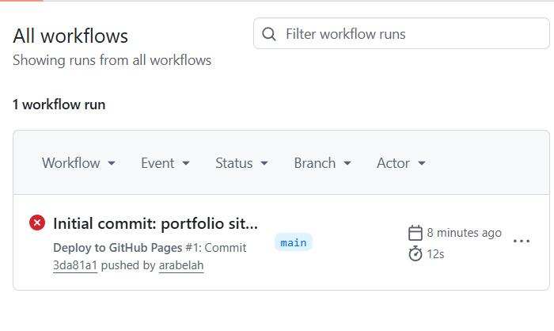
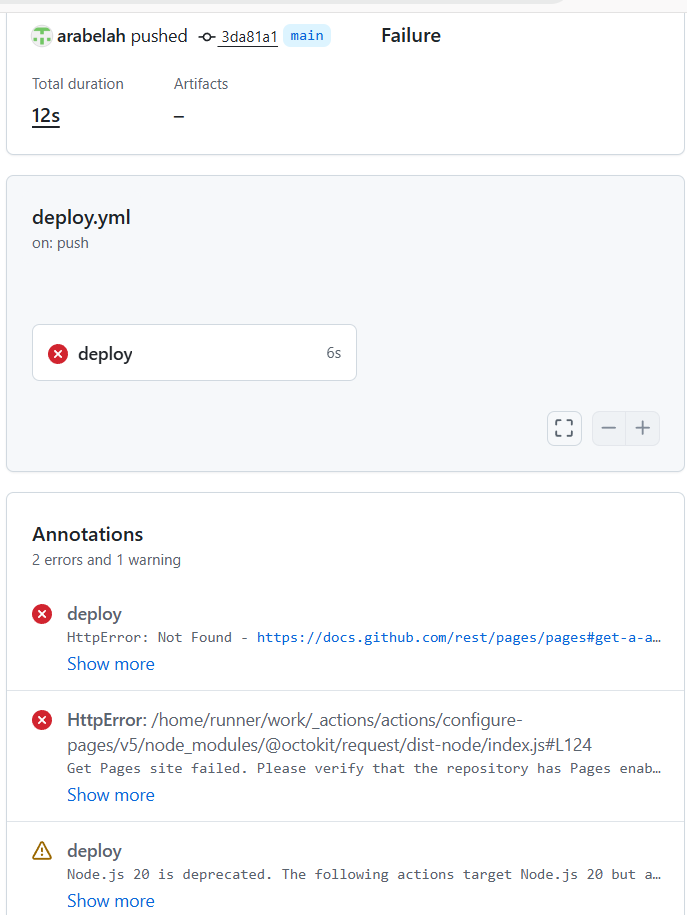
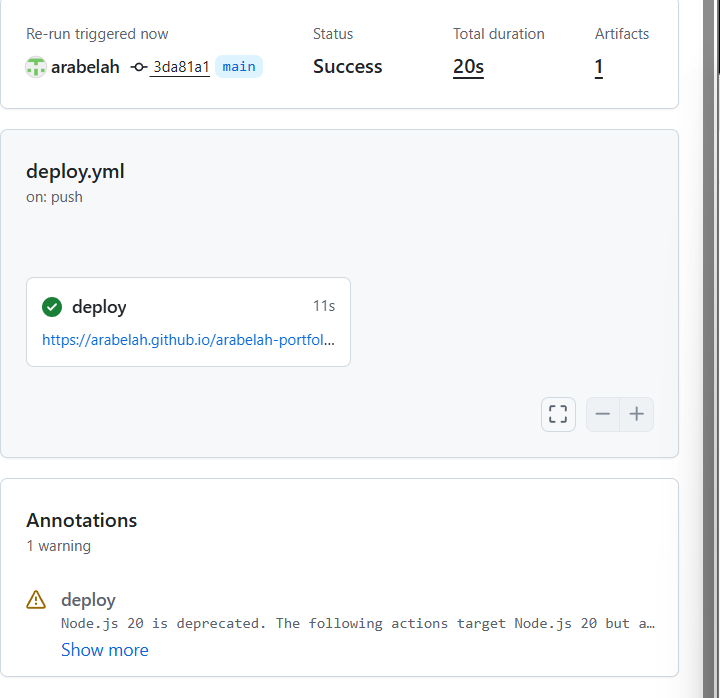
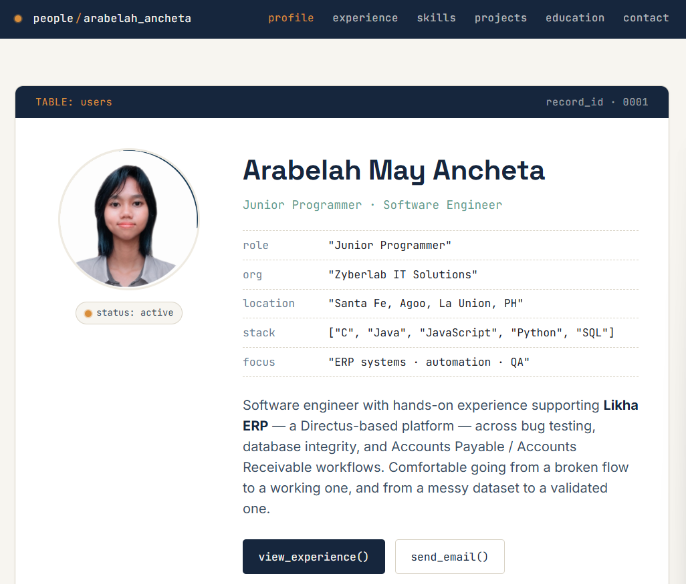
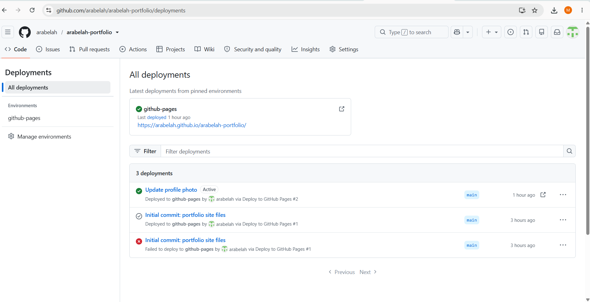
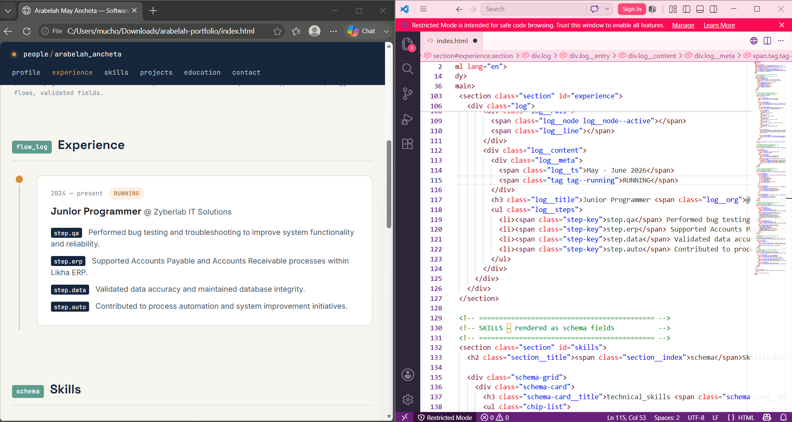

# Arabelah May Ancheta — Personal Profile

This personal profile was inspired by the kind of work I do every day during
my internship/OJT.

Instead of a typical resume website, I wanted my portfolio to reflect my
experience working with ERP systems, databases, and automation using Likha
ERP (built on Directus). The goal wasn't just to list my skills and
projects, but to give visitors a feel for how I actually think and work.

**Live site:** https://arabelah.github.io/arabelah-portfolio/

## Why does my portfolio look like an ERP system?

During my internship, I spent most of my time working with records,
workflows, schemas, and automation logs inside an ERP environment. So
instead of presenting my resume the usual way, I designed each section to
resemble the systems I actually work with:

| Section | Designed to look like | Why |
|---|---|---|
| **Hero / Profile** | A database record (`TABLE: users`) | Reflects my experience working with structured records |
| **Experience** | Workflow logs with timestamps and step labels | Mirrors how automation activities are tracked inside ERP systems |
| **Skills** | Database schema fields (`array[string]`) | Highlights my interest in structured, organized information |
| **Projects** | Deployments / builds | Reflects how real systems move from development to release |

## Design choices

- **Deep navy** — professionalism, pulled from my original CV
- **Amber** — a "status: active" indicator, like the labels on ERP dashboards
- **Teal** — labels and highlights, inspired by admin panel interfaces

**Typography:** Space Grotesk for headings, JetBrains Mono for code-like
labels and timestamps, Inter for body text.

## Built with simplicity

Plain **HTML, CSS, and vanilla JavaScript** — no frameworks, no build step.
Keeps the project lightweight, easy to understand, and fast to load.

- `index.html` — page structure and content
- `style.css` — all styling, organized by component
- `script.js` — active-section nav highlighting + a small themed console log
- `assets/profile.png` — profile photo
- `.github/workflows/deploy.yml` — auto-deploys to GitHub Pages on every push

## How this was built

I used an AI assistant (Claude) to generate the first draft of the site
from my CV, then reviewed, edited, tested, and published the final version
myself.

1. **Generated the first draft** — gave Claude my CV and asked it to design
   a portfolio inspired by my ERP/automation background.
2. **Reviewed and edited the output** — checked the content against my
   actual CV, adjusted wording and layout, and fixed anything that didn't
   represent me accurately.
3. **Installed Git** and verified it with `git --version`.
4. **Initialized my own repository** from scratch:
   ```bash
   git init
   git config user.name "Arabelah May Ancheta"
   git config user.email "anchetaarabelah@gmail.com"
   git branch -m main
   ```
5. **Committed my work**:
   ```bash
   git add .
   git commit -m "Initial commit: portfolio site files"
   ```
6. **Created a public GitHub repository** (`arabelah-portfolio`) and pushed:
   ```bash
   git remote add origin https://github.com/arabelah/arabelah-portfolio.git
   git push -u origin main
   ```
7. **Enabled GitHub Pages** in Settings, using **GitHub Actions** as the
   deployment source.
8. **Troubleshot the first deploy**, which failed with:
   ```
   Get Pages site failed. Please verify that the repository has Pages enabled.
   ```
   This happened because the workflow ran before Pages was fully enabled.
   Fixed it by re-running the failed job from the **Actions** tab — the
   second run succeeded.
9. **Updated the profile photo** later by replacing `assets/profile.png`
   and pushing again:
   ```bash
   git add assets/profile.png
   git commit -m "Update profile photo"
   git push
   ```
10. **Verified the live site** — checked every section (profile, experience,
    skills, projects, education, contact) rendered correctly after each
    deploy.

## Troubleshooting evidence

The first GitHub Pages deployment failed. Here's what happened and how I
fixed it:

**1. The first deploy run failed:**



**2. Checking the error details showed the cause** — the workflow tried to
deploy before GitHub Pages was fully enabled on the repository:



**3. After enabling Pages and re-running the job, it succeeded:**



**4. The live site loaded correctly with all sections working:**



**5. Confirmed all deployments in the GitHub Deployments history** — shows
the failed first attempt, the successful re-run, and the later photo update,
all in one place:



**6. Edited the actual HTML code directly in VS Code** — for example,
updating the experience date range — to make the content more accurate:



## Contact

- Email: anchetaarabelah@gmail.com
- Phone: +63 956 698 5886
- Location: Santa Fe, Agoo, La Union, Philippines
